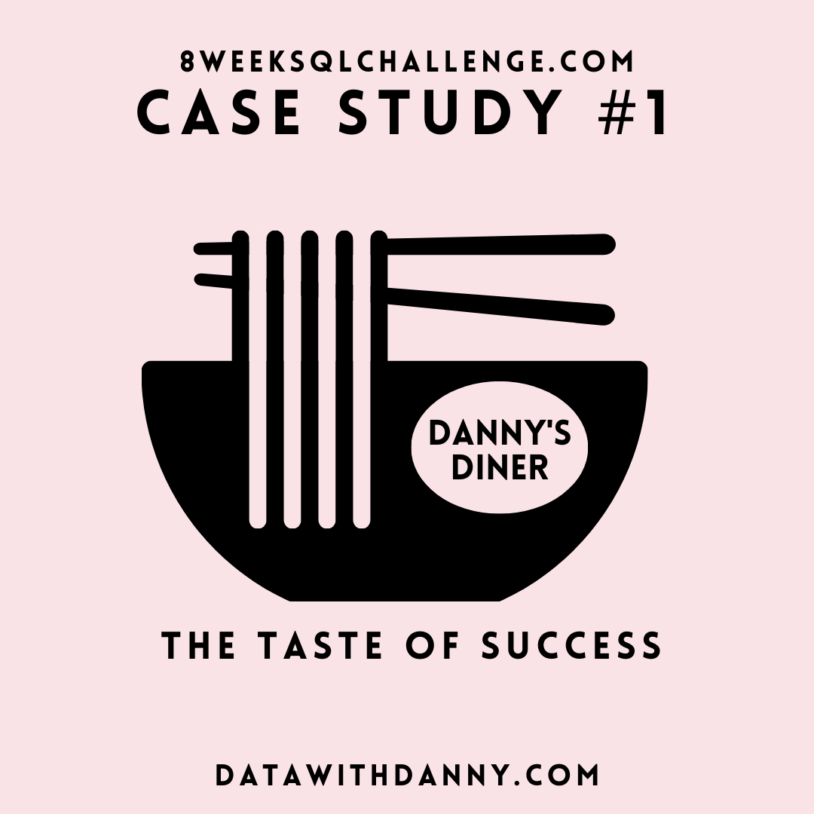
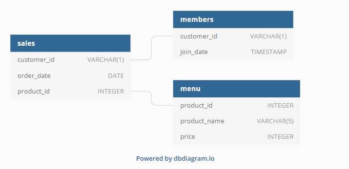

# Case Study #1: Danny's Diner


## Table of Contents:
* [Introduction](#introduction)
* [Tools](#tools)
* [Problem Statement](#problem-statement)
* [Dataset](#dataset)
* [Analysis](#analysis)

## Introduction

Welcome to this SQL project, which is part of [Danny Ma's 8WeekSQLChallenge](https://8weeksqlchallenge.com/)! Our objective is to use SQL to tackle eight fascinating case studies.

Please note that all the information needed for the case study will be obtained from [here](https://8weeksqlchallenge.com/case-study-1/).


## Tools
* **PostgreSQL**: database management system to create and manage the database schema for this project.
* **VS Code**: code editor for developing and executing SQL queries.
* **Git & Github**: for version control, project tracking and sharing my scripts and analysis.

## Problem Statement
Danny opened a Japanese food restaurant in 2021. He wants to use the data to answer key questions about his customers visiting patterns, total expenditure, and their favorite menu items with the aim of delivering a better and more personalised experience for his loyal customers.\
He wants to use our insights to make an informed decision regarding expanding his existing customer loyalty program. Addidtionally, he wants to create some basic datasets so his team can easily inspect the data without needing to use SQL.

## Dataset
Danny provided us with 3 datasets: sales, members and menu:
* **sales**: Contains customer order information, including the order date and menu items ordered.
* **menu**: Provides information on menu items and their prices.
* **members**: Holds data on customers who joined the loyalty program, including the date they joined.

Below is the entity relationship diagram (ERD) showing the relationships between the tables:


## Analysis 

### What is the total amount each customer spent at the restaurant?

```sql
SELECT 
    customer_id, 
    SUM(price) AS total_sales
FROM sales
JOIN menu
USING(product_id)
GROUP BY 1
ORDER BY 2 DESC;
```
From the table below, we can see that customer A spent the most ($76), closely followed by customer B ($74), and cutomer C spent the least ($36). 
|customer_id|total_sales|
|-----------|-----------|
|A          |76         |
|B          |74         |
|C          |36         |

### How many days has each customer visited the restaurant?
```sql
SELECT 
    customer_id, 
    COUNT(DISTINCT order_date) AS num_visits
FROM sales
GROUP BY 1
ORDER BY 2 DESC;
```
From the table below, we can see that customer B visited the most with 6 visits, followed by customer A with 4 visits, and customer C with 2 visits.
|customer_id|num_visits|
|-----------|----------|
|B          |6         |
|A          |4         |
|C          |2         |

### What was the first item from the menu purchased by each customer?
```sql
SELECT 
    DISTINCT customer_id, 
    product_name
FROM sales
JOIN menu
USING(product_id)
WHERE (customer_id, order_date) IN (
    SELECT customer_id, MIN(order_date)
    FROM sales
    GROUP BY 1
)
ORDER BY 1;
```
The data shows that customer A's first order was curry and sushi, customer B's first order was curry, and customer C's first order was ramen.
|customer_id|product_name|
|-----------|------------|
|A          |curry       |
|A          |sushi       |
|B          |curry       |
|C          |ramen       |

### What is the most purchased item on the menu and how many times was it purchased by all customers?
```sql
SELECT 
    product_name,
    COUNT(product_id) AS num_purchases
FROM sales
JOIN menu
USING(product_id)
GROUP BY 1
ORDER BY 2 DESC
LIMIT 1;
```
The data shows that the most popular item on the menu is ramen, purchased a total of 8 times.
|product_name|num_purchases|
|------------|-------------------|
|ramen       |8                  |

### Which item was the most popular for each customer?
```sql
WITH cust_purchases AS (
    SELECT 
        customer_id, 
        product_name, 
        COUNT(*) AS num_purchases, 
        DENSE_RANK() OVER(PARTITION BY customer_id ORDER BY COUNT(*) DESC) AS purchases_rank
    FROM sales
    JOIN menu
    USING(product_id)
    GROUP BY 1, 2
)
SELECT 
    customer_id, 
    product_name,
    num_purchases
FROM cust_purchases
WHERE purchases_rank = 1
ORDER BY 1;
```
The table below shows that customers A and C have a strong preference for ramen. Customer B has a more varied taste, and enjoys all items on the menu equally.

|customer_id|product_name|num_purchases|
|-----------|------------|-------------|
|A          |ramen       |3            |
|B          |sushi       |2            |
|B          |curry       |2            |
|B          |ramen       |2            |
|C          |ramen       |3            |

### Which item was purchased first by the customer after they became a member?

```sql
WITH orders_ranks AS (
    SELECT 
        customer_id, 
        product_id,
        order_date,
        DENSE_RANK() OVER (
            PARTITION BY customer_id 
            ORDER BY order_date) AS order_rank
    FROM sales
    JOIN members
    USING(customer_id)
    WHERE order_date >= join_date
)
SELECT 
    customer_id, 
    product_name
FROM orders_ranks
JOIN menu
USING(product_id)
WHERE order_rank = 1
ORDER BY 1;
```
The table below shows that customer A purchased curry and customer B purchased sushi as their first item after becoming a member.
|customer_id|product_name|
|-----------|------------|
|A          |curry       |
|B          |sushi       |

### Which item was purchased just before the customer became a member?
``` sql
WITH orders_ranks AS (
    SELECT 
        customer_id, 
        product_id,
        order_date,
        DENSE_RANK() OVER (
            PARTITION BY customer_id 
            ORDER BY order_date DESC) AS order_rank
    FROM sales
    JOIN members
    USING(customer_id)
    WHERE order_date < join_date
)
SELECT
    customer_id, 
    product_name
FROM orders_ranks
JOIN menu
USING(product_id)
WHERE order_rank = 1
ORDER BY 1;
```
The table below shows that customer A purchased sushi and curry before becoming a member. Customer B also purchased sushi before becoming a member.
|customer_id|product_name|
|-----------|------------|
|A          |sushi       |
|A          |curry       |
|B          |sushi       |
### What is the total items and amount spent for each member before they became a member?
```sql
SELECT 
    s.customer_id, 
    COUNT(s.product_id) AS num_items,
    SUM(price) AS total_sales
FROM sales AS s
JOIN members AS mem
ON s.customer_id = mem.customer_id
AND s.order_date < mem.join_date
JOIN menu
USING(product_id)
GROUP BY 1
ORDER BY 1;
```
The data shows that before becoming members, customer A purchased 2 items for a total of $25, while customer B purchased 3 items for a total of $40.
|customer_id|num_items|total_sales|
|-----------|---------|-----------|
|A          |2        |25         |
|B          |3        |40         |

### If each $1 spent equates to 10 points and sushi has a 2x points multiplier - how many points would each customer have?
```sql
SELECT 
    customer_id,
    SUM(CASE WHEN product_id = 1 
            THEN price * 20
        ELSE price * 10 END) AS total_points
FROM sales
JOIN menu
USING(product_id)
GROUP BY 1
ORDER BY 2 DESC;
```
The table below shows that customer A would have the maximum points (940), followed by customer A (860), then customer C (360).
|customer_id|total_points|
|-----------|------------|
|B          |940         |
|A          |860         |
|C          |360         |


### In the first week after a customer joins the program (including their join date) they earn 2x points on all items, not just sushi - how many points do customer A and B have at the end of January?
```sql
SELECT
    s.customer_id,
    SUM(CASE WHEN s.order_date - mem.join_date < 7 
            THEN price * 20
        ELSE price * 10 END) AS total_points
FROM sales AS s
JOIN members AS mem
ON s.customer_id = mem.customer_id
AND order_date >= join_date
JOIN menu
USING(product_id)
WHERE order_date <= '2021-01-31'
GROUP BY 1
ORDER BY 2 DESC;
```
**Assumptions:**
1. Loyalty program rewards points only for purchases made **after** customers join. Orders placed before joining the program will be excluded.
2. During their first week as members, they earn double points (20 points per $1 spent) on all items.
3. After the first week of membership and until the end of January, members earn the standard rate of 10 points per $1 spent on all items.
<br><br>

The table below shows that customer A would have 1020 points, while customer B would have 320 points.

|customer_id|total_points|
|-----------|------------|
|A          |1020        |
|B          |320         |

## Bonus Questions:
### 1. Join All The Things
Danny wants us to create a table containing all the information across all tables, including a column showing whether the customer was a member at the time of the purchase.
```sql
SELECT 
    s.customer_id, 
    s.order_date,
    m.product_name,
    m.price,
    CASE WHEN mem.join_date <= s.order_date
        THEN 'Y'
    ELSE 'N' END AS member
FROM sales AS s
LEFT JOIN menu AS m
USING(product_id)
LEFT JOIN members AS mem
USING(customer_id)
ORDER BY 1, 2;
```
|customer_id|order_date|product_name|price|member|
|-----------|----------|------------|-----|------|
|A          |2021-01-01|sushi       |10   |N     |
|A          |2021-01-01|curry       |15   |N     |
|A          |2021-01-07|curry       |15   |Y     |
|A          |2021-01-10|ramen       |12   |Y     |
|A          |2021-01-11|ramen       |12   |Y     |
|A          |2021-01-11|ramen       |12   |Y     |
|B          |2021-01-01|curry       |15   |N     |
|B          |2021-01-02|curry       |15   |N     |
|B          |2021-01-04|sushi       |10   |N     |
|B          |2021-01-11|sushi       |10   |Y     |
|B          |2021-01-16|ramen       |12   |Y     |
|B          |2021-02-01|ramen       |12   |Y     |
|C          |2021-01-01|ramen       |12   |N     |
|C          |2021-01-01|ramen       |12   |N     |
|C          |2021-01-07|ramen       |12   |N     |

### 2. Rank All The Things
Danny also requires us to add a column to rank customer purchases based on order date. He wants member-only purchases to be ranked so he expects null ranking values for the records when customers are not yet part of the loyalty program.
```sql
SELECT 
    s.customer_id, 
    s.order_date,
    m.product_name,
    m.price,
    CASE WHEN mem.join_date <= s.order_date
        THEN 'Y'
    ELSE 'N' END AS member,
    CASE WHEN s.order_date >= mem.join_date
        THEN DENSE_RANK() OVER (
            PARTITION BY customer_id
            ORDER BY CASE WHEN s.order_date >= mem.join_date
                THEN order_date END
  ) END AS ranking
FROM sales AS s
LEFT JOIN menu AS m
USING(product_id)
LEFT JOIN members AS mem
USING(customer_id)
ORDER BY 1, 2;
```
|customer_id|order_date|product_name|price|member|ranking|
|-----------|----------|------------|-----|------|-------|
|A          |2021-01-01|sushi       |10   |N     |       |
|A          |2021-01-01|curry       |15   |N     |       |
|A          |2021-01-07|curry       |15   |Y     |1      |
|A          |2021-01-10|ramen       |12   |Y     |2      |
|A          |2021-01-11|ramen       |12   |Y     |3      |
|A          |2021-01-11|ramen       |12   |Y     |3      |
|B          |2021-01-01|curry       |15   |N     |       |
|B          |2021-01-02|curry       |15   |N     |       |
|B          |2021-01-04|sushi       |10   |N     |       |
|B          |2021-01-11|sushi       |10   |Y     |1      |
|B          |2021-01-16|ramen       |12   |Y     |2      |
|B          |2021-02-01|ramen       |12   |Y     |3      |
|C          |2021-01-01|ramen       |12   |N     |       |
|C          |2021-01-01|ramen       |12   |N     |       |
|C          |2021-01-07|ramen       |12   |N     |       |

## Thank you! 
