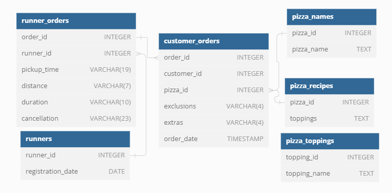

# Case Study #2: Pizza Runner

## Table of Contents:
* [Introduction](#introduction)
* [Tools](#tools)
* [Problem Statement](#problem-statement)
* [Dataset](#dataset)
* [Analysis](#analysis)

## Introduction

Welcome to this SQL project, which is part of [Danny Ma's 8WeekSQLChallenge](https://8weeksqlchallenge.com/)! Our objective is to use SQL to tackle eight fascinating case studies.

Please note that all the information needed for the case study will be obtained from [here](https://8weeksqlchallenge.com/case-study-2/).

## Tools
* **PostgreSQL**: database management system to create and manage the database schema for this project.
* **VS Code**: code editor for developing and executing SQL queries.
* **Git & Github**: for version control, project tracking and sharing my scripts and analysis.

## Problem Statement

## Dataset

Below is the entity relationship diagram (ERD) showing the relationships between the tables:

## Analysis

## Thank you!